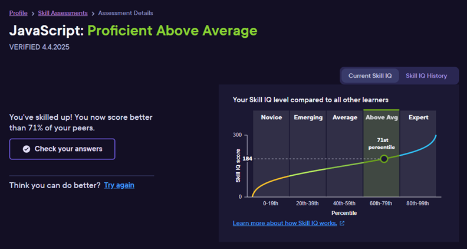
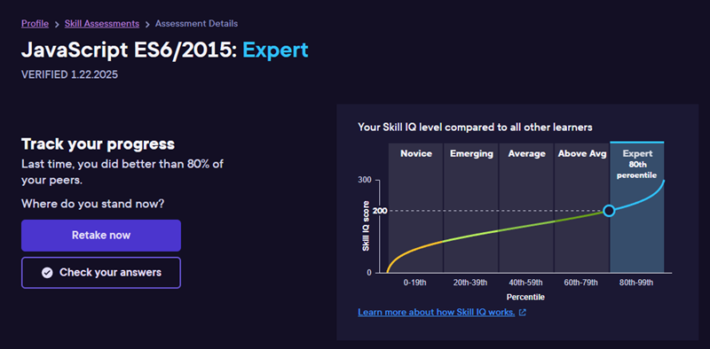

# Welcome to my Developer Portfolio

---

## 🌐 Internet Profiles

**StackOverflow:**  

---

## 📝 Recent Activity

> _Check out my latest skills assessments, certifications, and projects below!_

---

## 🏆 PluralSight Skills Assessments

| Date        | Assessment                                      | Badge/Result |
|-------------|-------------------------------------------------|--------------|
| **Apr 2025**| JavaScript Skills Assessment                    |  |
| **Jan 2025**| ES6/2015 JavaScript Self Assessment (accidental)|  |

---

## 🎓 Certifications

| Date           | Certification         | Badge/Link |
|----------------|----------------------|------------|
| **Nov 2021**   | Microsoft AZ-900     |  |

---

## 💼 Some stuff I've been working on

### 2024

I've spent a lot of time on PluralSight video training and LeetCode algorithm challenges. Please take a look at [my PluralSight profile](https://app.pluralsight.com/profile/joseph-hoppe-23) for more info and at [My LeetCode profile](https://leetcode.com/u/jhoppe/).

### 2022-2023

Studied:

* [AWS Cloud Development Kit: The Big Picture AWS Cloud Development Kit (CDK): The Big Picture](https://app.pluralsight.com/library/courses/aws-cloud-development-kit-big-picture/table-of-contents)
* [Introduction to Amazon CloudWatch](https://app.pluralsight.com/course-player?clipId=e6b5ca66-5f96-431f-97a9-318a2f273883)
* [Utilizing Amazon Eventbridge in Serverless Applications](https://app.pluralsight.com/library/courses/utilizing-amazon-eventbridge-serverless-applications/table-of-contents)
* [Introduction to the Amazon Simple Workflow](https://app.pluralsight.com/library/courses/introduction-amazon-simple-workflow/table-of-contents)

Reltio Master Data Management Courses (learn.reltio.com):

* Graph Search
* Data Export using the Export API
* Reltio Configuration Fundamentals
* Export DataConfiguration Fundamentals - Exporting Data
* Configuring the Reltio Data Model
* Introduction to Master Data Management with Reltio

### April 28, 2022

I've gotten a lot of technical questions on interviews over the years. To help get in the frame of mind, and as a refresher on some concepts, I've been maintaining this [developer interview prep spreadsheet](https://docs.google.com/spreadsheets/d/1DBYbO0fe2HqBWXLBd-lXhVBXevqaq20M3NavlhX0rbI/edit?usp=sharing) over the years

Completed watching [PluralSight: Node.js 12: The Big Picture](https://app.pluralsight.com/library/courses/nodejs-big-picture/table-of-contents). Good refresher on the architecture of NodeJS and it's current state.

### February 2022

Studied [Snowflake SnowPRO Core Exam Preparation](https://training.snowflake.com/lmt/clmsCatalogDetails.prMain?in_sessionId=38AJ428819144350&in_from_module=CLMSBROWSEV2.PRMAIN&in_offeringId=98874402)

### April 12, 2022

[My PluralSight activity](https://github.com/joehoppe/joehoppe.github.io/blob/main/PluralSight%20profile%202022.pdf) was under a different account from May 2019 to April 2022. See linked file for list of courses taken.

### June 21, 2019

Implemented an Azure Devops CI/CD pipeline to my personal UAT website hoppeuat.azurewebsites.net (I have taken it down since then)

### April 19, 2019

Back in action blogging! [Removing unnecessary using statements](https://medium.com/@JosephHoppe/removing-unnecessary-using-statements-from-a-large-solution-is-a-quick-and-easy-way-to-improve-the-cb672702f0e6).

### Jan 3, 2017

Wrote my first blog post! [.Net developer revisits Java after a decade](https://medium.com/@JosephHoppe/net-developer-revisits-java-after-a-decade-592e79547d34)

### May 1, 2016

Completed PluralSight course [Using Git for Source Control in Visual Studio 2019](https://app.pluralsight.com/library/courses/using-git-source-control-visual-studio/table-of-contents)

### April 13, 2016

Redesigned the site using React-Create-App (React 16).

### October 30, 2016

Began project to upgrade this site from Angular 1 to 2.

### 2016 Azure website <www.josephhoppe.com> (since removed)

I used to maintain <www.josephhoppe.com>, but have since taken it down. On the site:

* Implemented a TypeScript outFile for a simple form of cache busting! I.e. "outFile": "./build / build_1.0.001.js"
* Switched hosting providers from AppHarbor to an Azure web app!
* Launched my first Node.js app on AppHarbor! It's a couple landing pages that provide links to the new Azure app
* Added an About Me page!
* Replaced Bower with NPM!
* Linted the site with TSLint!
* Enabled HTML 5 mode routing! Not interested in supporting < IE11.
* Migrated much of the site's JS to TypeScript 1.8!

### 2015 AppHarbor site hoppe.apphb.com (since removed)

* Disabled Angular debugInfo to improve performance!
* Wrote my first LESS, and compiled it with Gulp!
* Vetted it with JSCS and JSHint, all thanks to John Papa’s course on JavaScript Build Automation with Gulp.js!
* Upgraded to Angular 1.4.4!
* Added a Bootstrap stylesheet from Bootswatch as well.
* Mocked out this backend using ngMock.
* Upgraded to Angular 1.4.4!
* Added a Bootstrap stylesheet from Bootswatch as well.
* Mocked out this backend using ngMock.
* Redid the site using Bower 1.3 as a package manager!
* Implemented a rough Angular CDN failback mechanism.
* Loving the Visual Studio SideWaffle templates!

### April 10, 2015

Wrote my first AngularJS plugin module! Find Angular Errors on Toast on Github.

### November 20, 2014

I’ve been looking long and hard for great resources for application architects. There appears to be a great shortage. But I did find one good one: [High Scalability](https://highscalability.com). I recommend checking it out. They seem to have great articles on improving performance and designing software.

### November 7, 2014

Earned 1,000+ reputation on StackOverflow! [My StackOverflow Profile](https://stackoverflow.com/users/846844/hoppe)

### May 22, 2014

I told my manager that I was learning AngularJS. He asked me to demo what I had done to him and my teammates. Bored them to death! :)

### 2014 AppHarbor site hoppe.apphb.com (since removed)

Launched an AngularJS 1.2 site! Also built on:

* MVC 5.1 (MVC was later dropped)
* Bootstrap 3
* Google Analytics