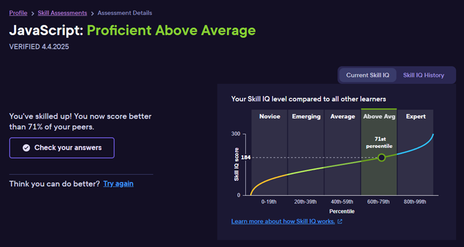
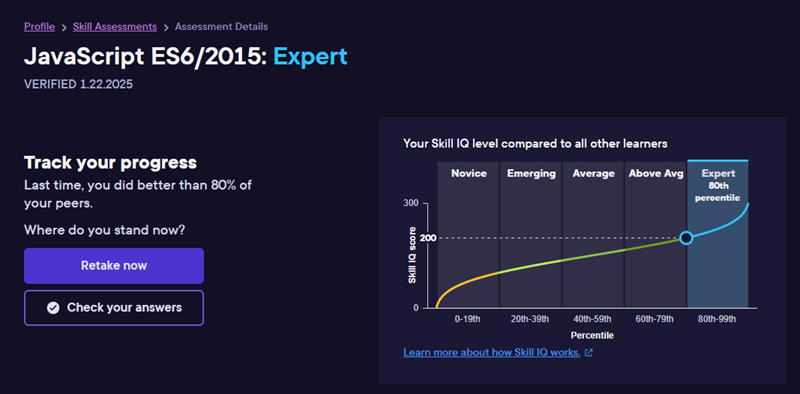

## Leader, developer, writer

> Short personal hub: blog posts, skills badges, and links to my profiles.

**StackOverflow:**  

---

## 📝 Recent Activity

> _Check out my latest skills assessments, certifications, and projects below!_

---

## 🏆 Certifications and PluralSight Skills Assessments

| Date        | Certification/Assessment                                      | Badge/Result |
|-------------|-------------------------------------------------|--------------|
| **Apr 2025**| JavaScript Skills Assessment                    |  |
| **Jan 2025**| ES6/2015 JavaScript Self Assessment|  |
| **Nov 2021**   | Microsoft AZ-900     |  |

---

### 2026

- [When you're scheduled to go on your first international business trip to India on February 29, 2020](https://dev.to/joehoppe/when-youre-scheduled-to-go-on-your-first-international-business-trip-to-india-on-february-29-4i7j) — dev.to article
- [How will AI affect the cost of software development in 2026?](https://dev.to/joehoppe/how-will-ai-affect-the-cost-of-software-development-in-2026-a22) — dev.to article

### 2025

- [Neural Networks: Developing a Really Simple Neuron in TypeScript](https://dev.to/joehoppe/neural-networks-developing-a-really-simple-neuron-in-typescript-4fc1) — dev.to article
- [Building a Universal Language Translator with Python and LangChain](https://dev.to/joehoppe/building-a-universal-language-translator-with-python-and-langchain-212h) — dev.to article
- [Fixing VPN and VPC Connectivity Issues with T-Mobile Home Internet](https://dev.to/joehoppe/fixing-vpn-and-vpc-connectivity-issues-with-t-mobile-home-internet-4gn1) — dev.to article

### 2024

- [Don't code a new website for your blog](https://dev.to/joehoppe/dont-code-a-new-website-for-your-blog-3epb) — dev.to article
- [AWS — Properly delete messages between Lambdas and SQS Queues](https://dev.to/joehoppe/aws-properly-delete-messages-between-lambdas-and-sqs-queues-41md) — dev.to article

### 2023

- [Overcoming Keyboard Wrist Pain](https://medium.com/@JosephHoppe/overcoming-keyboard-wrist-pain-9b9cfa3ffbdf) — Medium article
- [The free tier of GitHub Codespaces permanently changed my workflows as a developer](https://medium.com/@JosephHoppe/how-the-free-tier-of-github-codespaces-permanently-changed-my-workflows-as-a-developer-b85d61af983b) — Medium article
- [State of Linting in TypeScript: August 2023](https://medium.com/@JosephHoppe/state-of-linting-in-typescript-august-2023-551a99e0b3b3) — Medium article
- [I put together a developer interview prep spreadsheet (public) for practicing common questions and exercises](https://docs.google.com/spreadsheets/d/1DBYbO0fe2HqBWXLBd-lXhVBXevqaq20M3NavlhX0rbI/edit?usp=sharing) - Spreadsheet

### Older highlights

- [PluralSight activity (2019–2022)](https://github.com/joehoppe/joehoppe.github.io/blob/main/PluralSight%20profile%202022.pdf) — PDF
- [Removing unnecessary using statements from a large solution](https://medium.com/@JosephHoppe/removing-unnecessary-using-statements-from-a-large-solution-is-a-quick-and-easy-way-to-improve-the-cb672702f0e6) — Medium article
- [.Net developer revisits Java after a decade](https://medium.com/@JosephHoppe/net-developer-revisits-java-after-a-decade-592e79547d34) — Medium article

## 🧩 Notable Algorithm & Data Structure Practice

[My LeetCode Profile](https://leetcode.com/u/jhoppe/). List below last updated: May 2026.

| Date         | Problem |
|--------------|---------|
| Apr 2026     | 2894. Divisible and Non-divisible Sums Difference     |
| Mar 2026     | 2423. Remove Letter To Equalize Frequency |
| Feb 2026     | 28. Find the Index of the First Occurrence in a String    |
| Feb 2026     | 1480. Running Sum of 1d Array |
| Jul 2025     | 88. Merge Sorted Array |
| May 2025     | 844. Backspace String Compare |
| Apr 2025     | 11. Container With Most Water |
| Mar 2025     | 1805. Number of Different Integers in a String |
| Feb 2025     | 2181. Merge Nodes in Between Zeros |
| Jan 2025     | 78. Subsets |
| Dec 2024     | 1249. Minimum Remove to Make Valid Parentheses |
| Sep 2024     | 2807. Insert Greatest Common Divisors in Linked List |
| Jun 2024     | 1232. Check If It Is a Straight Line |
| Apr 2024     | 2785. Sort Vowels in a String |
| Apr 2024     | 535. Encode and Decode TinyURL |
| Dec 2023     | 2525. Categorize Box According to Criteria |
| Sep 2023     | 118. Pascal's Triangle |
| Jun 2023     | 1828. Queries on Number of Points Inside a Circle |
| May 2023     | 225. Implement Stack using Queues |
| Mar 2023     | 20. Valid Parentheses |
| Feb 2023     | 231. Power of Two |
| Jan 2023     | 14. Longest Common Prefix |
| Oct 2022     | 13. Roman to Integer |
| Jul 2022     | 1. Two Sum |
| Jun 2022     | 9. Palindrome Number |
| Jun 2022     | 938. Range Sum of BST |
| May 2022     | 1476. Subrectangle Queries |
| May 2022     | 905. Sort Array By Parity |

